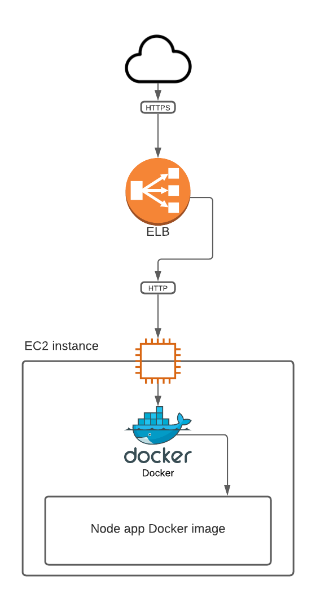
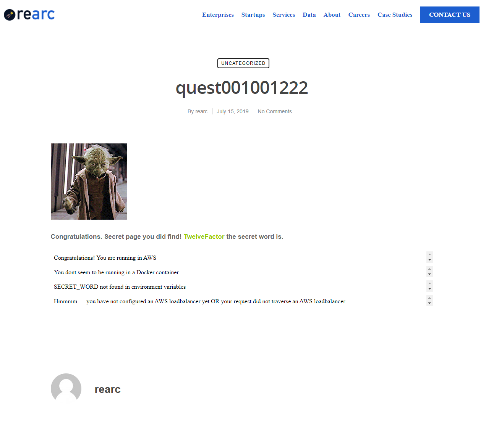
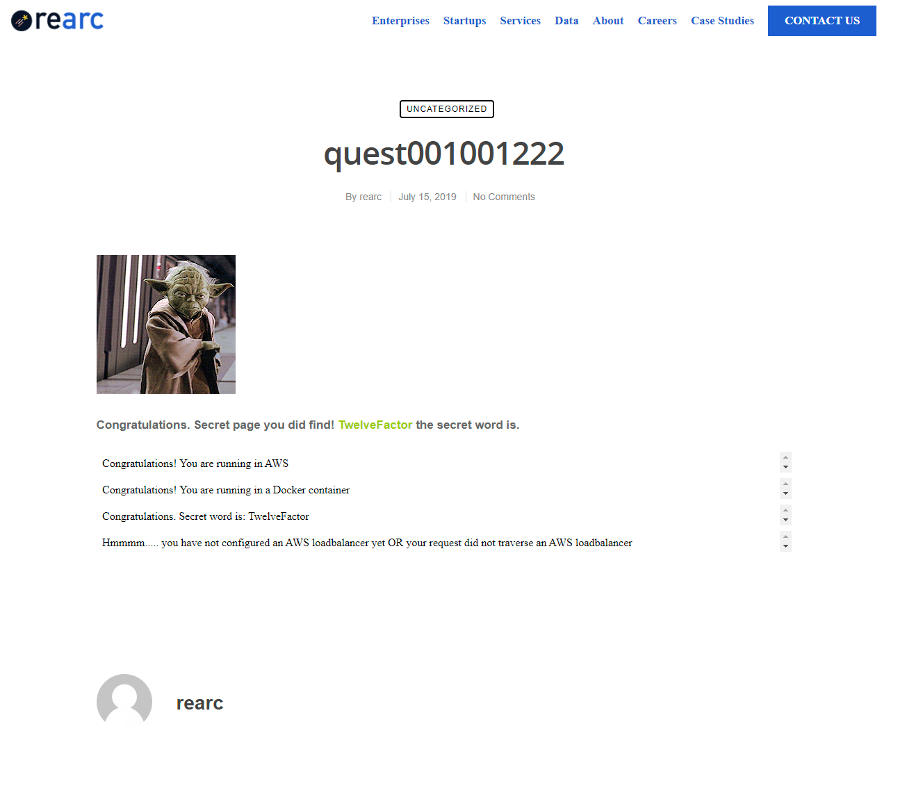
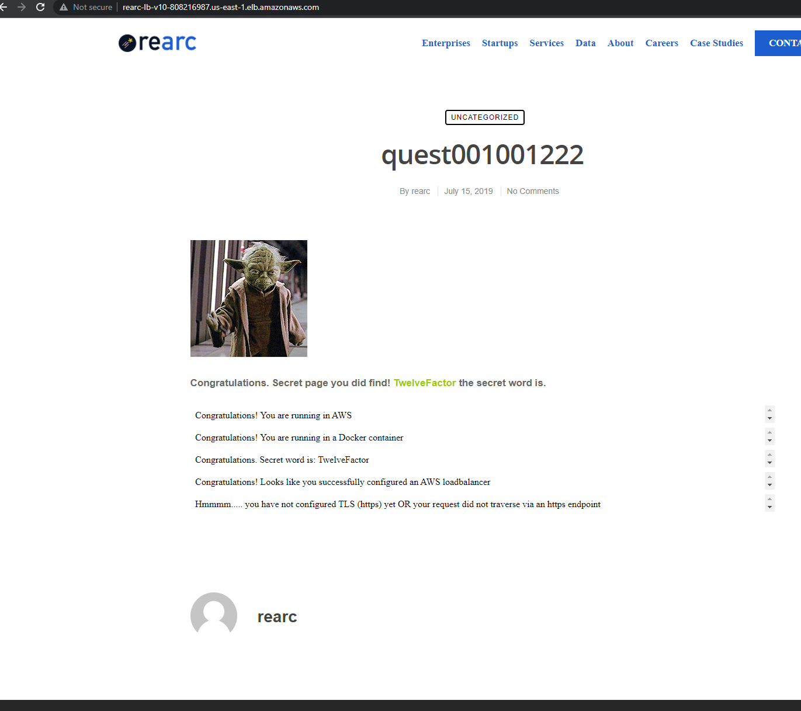
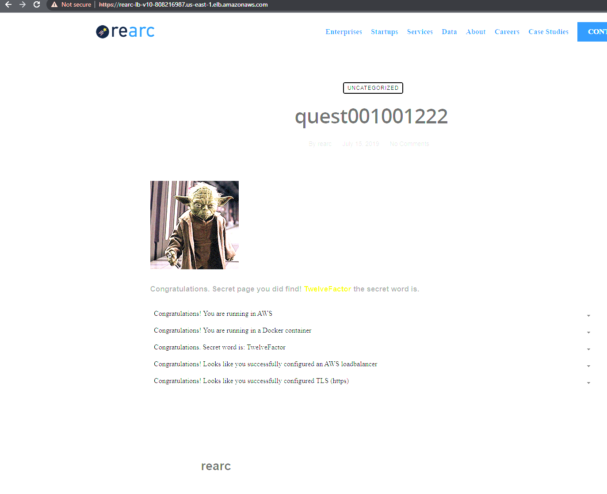
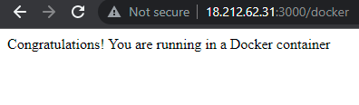
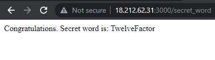
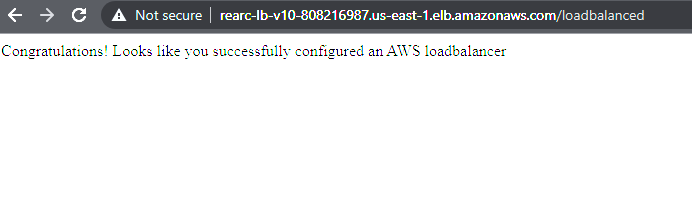
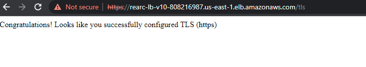

# rearc-terraform
A repository for Terraform code for the Rearc project and associated files for the Quest project

This code allows Terraform to spin up the infrastructure we need to run the Rearc Quest app, which includes:

- An EC2 instance built from an AMI
  - The AMI was built from an Amazon Linux instance with the following items configured:
    - Docker, Nodejs and Git installed with yum
    - A cloned copy of the Rearc Quest repository at https://github.com/rearc/quest
    - A Docker image containing the Rearc Quest app
    - A Systemd unit file that calls a script that starts this Docker image on boot
      - The script is just one line - `sudo docker run -p 80:3000 --env-file ./envs james/rearc-app`
  - The security group for the instance has the following rules that allow access:
    - An egress rule that allows all outbound traffic
    - An ingress rule that allows SSH traffic from our home IP over port 22
    - An ingress rule that allows HTTP traffic from anywhere over port 80

- An ELB (Elastic Load Balancer) with the following properties:
  - A listener that listens for requests on port 443 (HTTPS) that:
    - Handles SSL encryption with a self-signed SSL cert and performs SSL offloading
    - Sends traffic to port 80 on the EC2 instance where the app is listening
  - A health check that verifies that the EC2 instance is responding on HTTP port 80 every 30 seconds


When Terraform spins this EC2 instance up, the instance will accept traffic on port 22 for SSH access and port 80 for web based access to the app.
Terraform will also create an ELB with a self-signed SSL certificate and listen on port 443 for HTTPS traffic and then pass it to the instance on port 80

## Architecture diagram



## Contents of main.tf

In `main.tf`, we have the following items configured:

- Our provider - in this case, AWS, because we really like building cloud infrastructure on AWS

  - The region we're building the infrastructure in - `us-east-1` in this case
  - The location of our AWS credentials file
    - The profile in the AWS credentials file to use
    - This allows Terraform to build our infrastructure when it uses these credentials to authenticate with AWS

- The S3 bucket for our Terraform remote state file

  - The bucket being used in this case is `rearc-project-tfstate`
  - We're calling our state file `quest.json`
  - This bucket is located in the `us-east-1` region

- A resource that creates an AWS instance with the following properties:

  - Name `RearcServerInstance` (so we know what instance this is when we look in the AWS console)
  - AMI `ami-0ea00bb70e6d7d222` (The image we're building the instance from)
  - Instance type `t2.micro` (because the AWS free tier is awesome)

- A security group `rearc_server_sg` with the following rules:
  - Allows access to the instance via SSH from our home IP
  - Allows access to the instance app via the web on port 80 from anywhere

- An ELB with the following properties:

  - ELB Terraform name `rearc_elb`
  - ELB AWS name `rearc-terraform-elb`

  - Availability zones the ELB supports instances in:
    - us-east-1a
    - us-east-1b
    - us-east-1c

  - A listener that checks for incoming traffic on port 443
    - With a self-signed SSL certificate that handles the SSL portion of the connection
    - The ARN of the self-signed SSL cert we uploaded into AWS
    - The port on the instance that we want to send the traffic to, port 80 in this case
  - A health check with the following properties:

    ```
    healthy_threshold   = 3
    unhealthy_threshold = 10
    timeout             = 3
    target              = "HTTP:80/"
    interval            = 30
    instances                   = [aws_instance.rearc_server.id]
    cross_zone_load_balancing   = true
    idle_timeout                = 400
    connection_draining         = true
    connection_draining_timeout = 400
    ```

## Other files that are included and why

- A `.terraform-version` file that tells Terraform what version we're using, as that can be important when it comes to not breaking compatibility

- A `.gitignore` file that keeps us from committing the contents of the `.terraform` subdirectory as that will be unique to the local machine running Terraform

- A `Dockerfile` to show how we Dockerized (is that a word?) the app

- A `envs` file that we use when running the Docker container to inject our secret word as an environment variable

- Image files:

  - `0_initial-app-hosted.png` - An image that shows we've completed the first task
  - `1_app-hosted-with-docker-and-env-file.png` - An image that shows we've completed the second task
  - `2_app-hosted-with-docker-and-env-file-and-working-elb.png` - An image that shows we've completed the third task
  - `3_app-hosted-with-docker-and-env-file-and-working-elb-and-working-ssl.png` - An image that shows we've completed the fourth task
  - `4_docker-check.png` - An image that shows the results of the Docker check page
  - `5_secret-word-check.png` - An image that shows the results of the secret word check page
  - `6_elb-check.png` - An image that shows the results of the ELB check page
  - `7_tls-check.png` - An image that shows the results of the TLS/SSL check page

## Quest task images
















